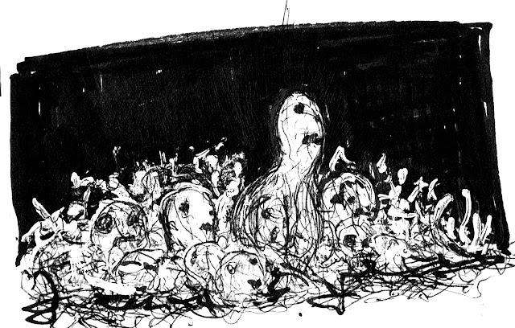

# Slangekongernes Grav

Version 4.0  
Den konsekvent inkonsekvente opdatering

Skrevet af **SKERPLES**  
[(coinsandscrolls.blogspot.com)](coinsandscrolls.blogspot.com)

Kunst af **SCRAP PRINCESS**  
[(monstermanualsewnfrompants.blogspot.com)](monstermanualsewnfrompants.blogspot.com)

Kort af **JANON**

Opsætning af **DAVID SHUGARS**  
[(the3d6.com)](the3d6.com)

Spiltestet af et forbløffende antal folk. I ved, hvem i er.  
Hvis du har spillet denne fangekælder og sendt mig noter, har jeg læst dem. Tusind tak.

Tilskyndelse fra mange, men især fra  
**ARNOLD K.**  
[(goblinpunch.blogspot.com)](goblinpunch.blogspot.com).

Bliv ved med at være sære.

## LICENSE

Værket er licenseret under [Creative Commons CC BY-NC-SA](https://creativecommons.org/licenses/by-nc-sa/3.0/).

Du kan dele det gratis, tilpasse det til dit eget system, redigere det, udskrive det og  
lægge det i den lokale spilforretninger. Du kan bare ikke sælge det for penge, og du  
skal kreditere Skerples et eller andet sted. Det samme gælder kunsten.
