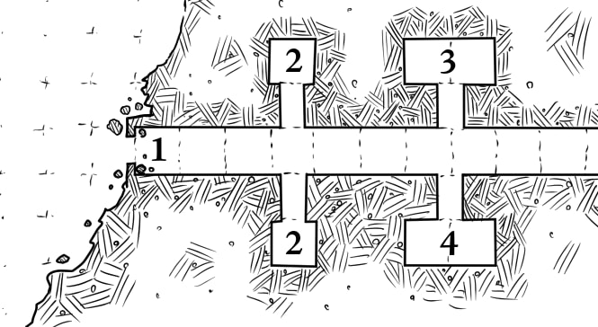

# 2: Guard Tombs

These small rooms are identical in size and content. They both
contain a wooden coffin with a clay statue of a snake-man
warrior inside. The statues are hollow. Each contains a gold
amulet worth 1gp, a dried snake skeleton, and a cloud of
poison gas (d6 damage, can only reduce a PC to 0 HP).

> **Lessons:** the dungeon is organized. There are patterns.
> There is hidden treasure. There is also hidden danger.
>
> The PCs will probably approach the 2nd coffin with
> more caution, and earn their reward (gold) without
> the danger (poison) by using their brains (and a rock
> or long stick).
