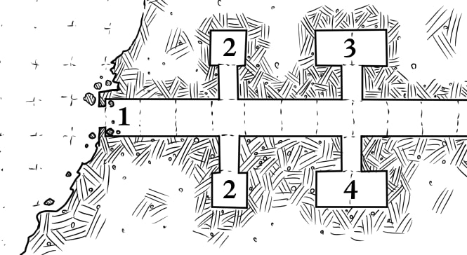

# 4: Sorcerer Tomb

Similar to **[2: Guard Tombs](./2_guard_tombs.md)**, but inside the coffin there is a
clay statue of a robed snake-man sorcerer wearing a silver
ring. If the PCs didn’t already learn that the other statues
were hollow, they’ll almost certainly try to pry the ring off,
breaking the statue open and revealing the poison gas
and amulet.

The ring is a magical, but also cursed. If worn on a finger,
the fingernail becomes long, bifurcated, and pointed like
twin fangs. It can be used like a poison dagger (living targets
must Save vs. Poison or take +1d6 poison damage on a hit),
but each morning, the wearer must Save vs. Poison or take
d6 damage. If they take 6 damage at once from the poison
ring, their finger falls off and turns into a snake.

> **Lessons:** Hidden treasure can be magical, useful, and sometimes cursed.
