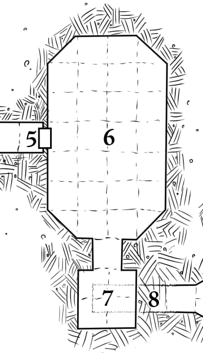

# 6: False King's Tomb

The burial chamber of a decoy snake-man king and his two
brides. On the north wall are three wooden coffins painted
with stylized sleeping snake-men. The coffin in the middle is
larger and more ornate. Each coffin contains a Skeleton (HD
2, MORALE 12, ATK 1d6 [Claw]) who will immediately
attack if their rest is disturbed.

> **Lessons:** there are undead in the dungeon. They take less damage from slashing weapons. PCs can use the environment against them (lure them into the hammer trap).
