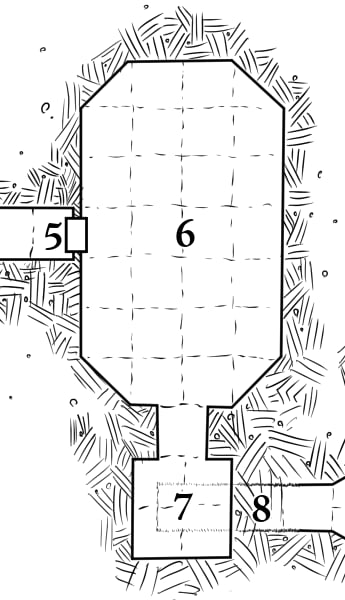

# 8: Secret Passage

This damp, narrow room lies directly below **[7: False Temple](./7_false_temple.md)**.
It is an alcove-like passage that widens to become **[9: Statue Hall](../2_the_upper_tomb/9_statue_hall.md)**.
