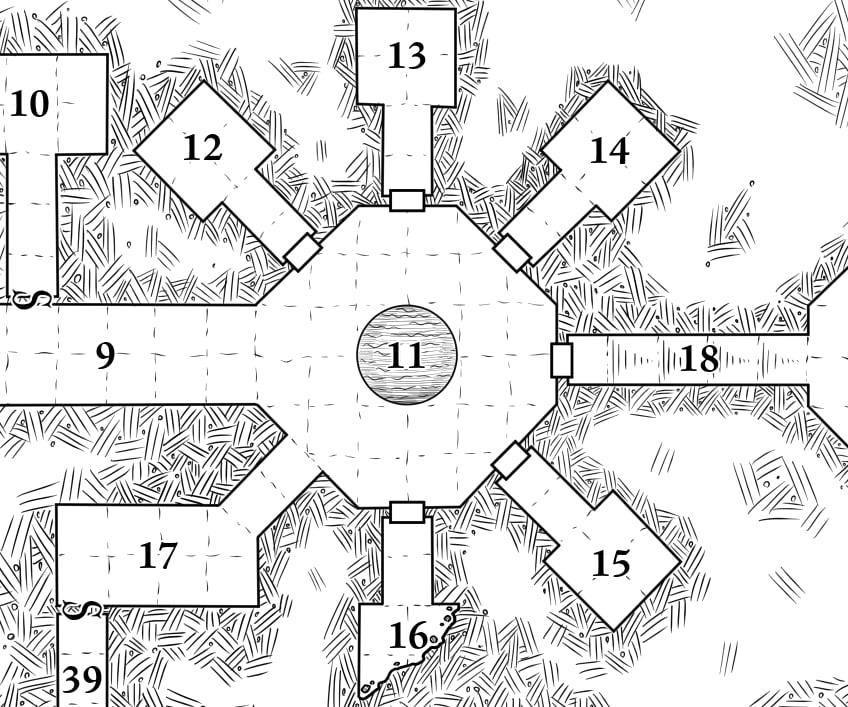

# 11: Tomb Atrium

The hallway opens into a large chamber octagonal chamber,
also ringed with glaring snake-man statues. Some carry
weapons, others carry implements of torture or agriculture.
The doors to rooms 12–16 are made of heavy stone, but can
be levered without much difficulty. [Room 15](./15_priest_room.md) has an unlocked
wooden door. [Room 18](./18_stairs.md) has a stone door, but it is much more
ornately carved than the others. There was once a pit in the
center of the room, but water trickling from the surface
(through rooms [7](../1_the_false_tomb/7_false_temple.md) and [9](./9_statue_hall.md)) has filled it to the brim with dark,
oily water that smells like licorice. The pool is 10' deep.

Inside the pool are 2 **[Mummy Claws](../monsters/2_mummy_fragments.md)** *(HD 2, MORALE 12, ATK 1d4 [Claw] or 1d6 [Strangle])*.
These rotting hands will jump out to attack anyone who comes within 5' of the pit.

> **Lessons:** there are *hidden monsters*. Some monsters also *inflict diseases*. It is very hard to hit a monster clinging to your friend’s throat.

Drinking the water or rubbing it into open wounds inflicts
Mummy Rot, but touching it does not. If the party kills or
disables both mummy claws and attempt to dredge or search
the pool, it contains:

1. a very angry and completely insane mummy’s head
2. a heavy gold chain worth 35gp
3. a magic silver ring
4. a magic utility item of the GMs choice, or a randomly rolled magic item, or 2d10gp in jewelry

The silver ring is a *ring of eyesight*. While wearing it,
one of the user's eyes pops out and becomes hard as
glass. The eye still sees normally.

> **Lessons:** look for treasure at the bottom of pits and pools. Magic items can solve problems.
