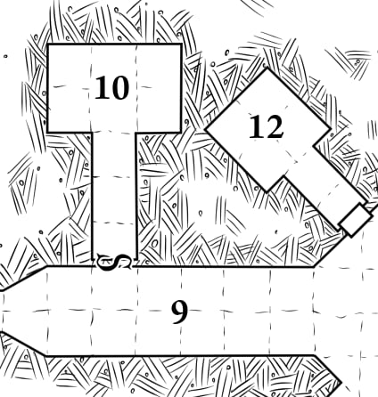

# 9: Statue Hall

A long, wide corridor. Six huge statues of heavily armed and
armored snake-men loom over the hall, glaring at the party.
One of the statues is twisted slightly out of alignment with
the wall. It can be moved to reveal **[10: Secret Guardroom](./10_secret_guardroom.md)**.

> **Lessons:** the party should have learned in **[7: False Temple](../1_the_false_tomb/7_false_temple.md)** that secret passages are hidden behind statues.

