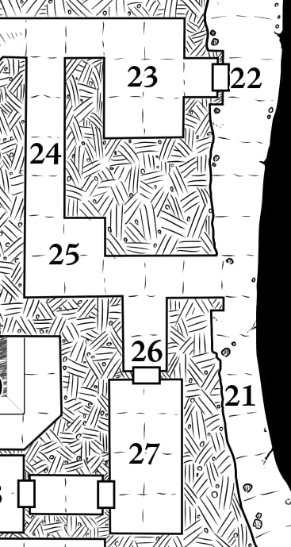
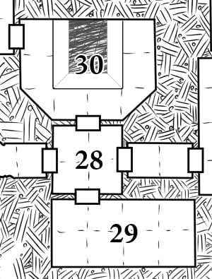

# The Lower Tomb

There are four main zones to **LEVEL 3**.

## Zones

**Outer Halls (22–26)**  
Dressed stone, slightly damp, mold and slime on the lower
walls. The air is cold, especially close to the chasm. Some
dry and dusty areas. Everything has carved or painted
snakes on it.

**Sacrifice Pit (27–30)**  
Dressed stone with ancient crumbling mosaics. The air is
warm and foul, and only gets worse as you approach 30:
SACRIFICE PIT.

**Xiximanter’s Lair (43–46)**  
Finely cut stone, covered in dust and cobwebs. Purple
lights and bubbling alchemical flasks. The glimmer of glass,
and the clatter of bones.

**Goblin Warren (47–52)**  
Dug through collapsed tunnels and rooms, or through
natural caves. Filthy. The floor is thick with guano, beetles,
and rot. It is difficult for the PCs to tell if the chittering is
beetles or goblins.

## Wandering Monsters

This level also contains **Wandering Monsters**. They are
attracted to noise, light, and heat. They won’t move to the
upper levels of the dungeon unless the **[Stone Cobra Guardian](../monsters/3_the_stone_cobra_guardian.md)** is defeated.

Check every 30 minutes on Level 3, or whenever the PCs make a lot of noise.

| **1d8** | **Wandering Monsters**                                                                                                                                           |
| :-----: | :--------------------------------------------------------------------------------------------------------------------------------------------------------------- |
|    1    | **Omen of Basilisk.** The rattle and thrash of a distant chain, dragged through stone and dust.                                                                  |
|    2    | **Omen of Jelly.** Wet squelching in the distance                                                                                                                |
|    3    | **Omen of Goblins.** Chittering, half-giggling, half grinding of teeth and licking of lips. The flit of red eyes in the distance. A waft of fungal rot.          |
|    4    | **Bat.** Not hostile, but startling. Flaps around, flies towards the chasm.                                                                                      |
|    5    | **Large Spider.** The size of a fist. Here to eat bats, not PCs. Venomous (1d4 poison damage) but cowardly. Considered a delicacy by the goblins                 |
|    6    | **1d6 [Fungus Goblins](../monsters/7_fungus_goblins.md).** In a scouting party. 1d6 other goblins lurk around the corner.                                        |
|    7    | **1 [Skeleton Jelly](../monsters/6_skeleton_jellies.md).**                                                                                                       |
|    8    | **1d10+5 [Fungus Goblins](../monsters/7_fungus_goblins.md).** In a raiding party. 1 goblin will have a ludicrously impractical cutlery spear (d6 damage, reach). |

## 22: Stone Door

Recessed 5' into the wall and held closed by a heavy stone
bar. The door is barred on the side facing the chasm. If
approached from the other side, it cannot be opened without
demolishing most of the door.

It contains the same type of hammer trap as **[5: Door/Hammer Trap](../1_the_false_tomb/5_door_hammer_trap.md)**,
but the hammer swings away from the door, rather than towards it.
This makes it easier to dodge (+2 bonus to the Save) but any hit PCs must Save again or
be flung into the chasm.

> **Lessons:** traps *repeat*. Be cautious around bottomless chasms.

## 23: Ceremonial Room

Used by the snake-man priests to prepare and meditate.
Contains several low benches, ancient wall hangings, and a
dry fountain. Goblins pried a gold statue from the fountain
and hid it in [49: Goblin Throne Room](#49_goblin_throne_room). A few scraps of
gold leaf worth 1gp and a primitive tool marks are all
that remain.

> **Lessons:** some rooms are safe. Look for what may be missing.

## 24: Hallway

A long, narrow hallway slopes downwards to the south.
Contains 1 **[Skeleton Jelly](../monsters/6_skeleton_jellies.md)** *(HD 2, MORALE 12, ATK 1d4
[Slam])* that will move towards noise

## 25: Pit Trap

This room has a false floor made of thin stone tiles. A 1'
wide ring around the walls is safe, but all other tiles are
held up by sticks and thin metal bars. Any PC stepping into
the center of the room must Save to Dodge or take 1d6
damage from the fall, and Save again or take a further 1d6
from the spikes at the bottom. The false tiles are easy to
spot: one is even missing.

The pit contains several mundane human skeletons and a
gold ring worth 2gp. The goblins use the pit to catch food,
replacing the lost tiles every day.

> **Lessons:** *check the floor*.

## 26: Hallway

A small passage branching off from the main hallway,
leading to a locked door. The lock is incredibly rusted with
age and the door opens easily.

## 27: Slave Room

The air here is foul and warm, and there is a distinct hissing
sound coming from the southwest door. This room was once
used to keep slaves, and a pair of iron manacles still lie on
the floor. The manacles are enchanted to lock around the legs
of anyone who approaches within 1', but the rusted metal is
weak and can be pried free with an easy Strength test.

> **Lessons:** *not all traps* are deadly. Beware of *wandering monsters* and *delays*.

## 28: Domed Hall

An elaborately carved domed hall with a locked iron door in
the south wall. The key to the door is around the Basilisk’s
neck. The door isn’t magical, but it would take a team of people
hours or days to pry it open or crack its hinges. There is a
broken stone door to the west. To the north are the flickering
orange light of **[30: The Sacrifice Pit](#30-sacrifice-pit)** and the hiss of the
eternal flame.

## 29: Treasure Room

This room contains... whatever it is you want to put in the
bottom of your dungeon: a boss fight, a rare item, piles of
gold, plot hooks, stairs to more dungeon levels. At the least,
it should contain 200gp of assorted treasure

## 30: Sacrifice Pit

An eternal flame burns in the center of a carved, 15' deep pit
with sloped sides. The flame is fueled by natural gases,
piped from a deep and ancient mine. There is a 2' wide
walkway around the pit. Carbonized bones coat the bottom.
While the air here is foul, it isn’t dangerous to anything
outside the pit. Creatures inside the pit must Save each round
or take 1d6 temporary Constitution damage. Unconscious PCs
slide down to the flame and take 2d6 fire damage per round.

There are runny streaks of gold around the flame, and a few
carbon-coated gemstones (worth 50gp total) glitter in the
orange light. Not all the sacrifices were poor.

> **Lessons:** some hazards are *invisible*.

## 31: Guarded Hall

Two incredibly life-like snake-man statues stand in
the bottom corners of this elaborately carved hall.
The statues are much finer than any other carving
in the tomb. They are, in fact, petrified snake-men,
placed here as punishment. If de-petrified, they will
fly into a murderous rage for 10 minutes, then
slowly give in to despair. The statues are worth
50gp each if sold in a major city, or 10x more to a
wizard who recognizes their nature.

> **Lessons:** look for *explanations* for things that are *out of place*.

## 32: Summoning Room

A long, narrow room with a huge pile of junk
(broken shields, bent swords, candlesticks, branches)
piled at the entrance. Clearing the pile takes thirty
minutes, and makes a terrific racket. This room was
once a summoning chamber. It contains a bound
**[Succubus](../monsters/4_succubus_baltoplat.md)** summoned by the snake-men to answer
questions about the lower hells. She appears as a young
botanist in an ankle shackle, of the same race as the first PC
she sees, and of an amenable gender. She will claim to have
been captured by the goblins. The shackle around her ankle
is an illusion. All she needs is for someone to step across the
(dust-covered and mostly obscured) circle binding her.

The room also contains a small altar, 2 gold bowls worth
15gp each, a +1 magic dagger, and a wavy stone snake that
detects as magical. The snake is used to open the door to
**[46: Throne Room](#46-throne-room)**. The succubus isn’t hostile to the PCs,
but she will try to isolate and kiss one of them (Save vs
Death, 1d6 permanent HP and Con damage if survived, age
1d10 years. +10 to Save if she likes you) so she can refuel
and fly away. Her true name (Baltoplat) is written on a scroll
in **[15: Priest Room](../2_the_upper_tomb/15_priest_room.md)**. The goblins fear her. Xiximanter
knows her true nature, but assumes the party knows as well.
She’s immune to petrification and very, very good at dodging.
She will immediately flee from any conflict. If made to bargain,
she can detect poison, reveal ancient secrets, or agree to kill
any one mortal the PCs can name. She is patient and cunning,
but true to her word.

> **Lessons:** some monsters have *hidden agendas*. There are *illusions*. Don’t let yourself be *isolated*. Don’t make noise
