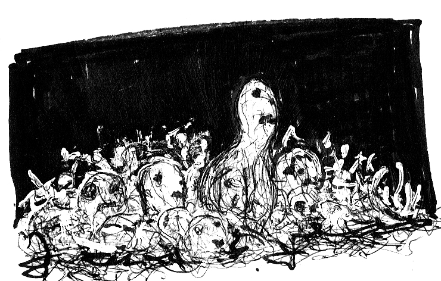

# Introduction

**WHEN YOU FIRST START UP** Super Mario Bros.,
the game doesn't give you any instructions. The first
level is cunningly designed to teach you the rules:
jump on enemies, pick up mushrooms, look for secrets, get coins,
avoid pits. There is no tutorial; the game itself is the tutorial.

Everyone can name “classic” dungeons—*Tomb of Horrors*,
*Barrier Peaks*, *The Temple of Elemental Evil*, etc.—but in order
for those adventures to make sense, there needs to be some
sort of introduction. Tomb of Horrors and Death Frost Doom
are both reactions to something, but what they are reacting
to doesn’t really exist as a published product.

It's like all the adventures we have are Bach concertos.
People keep writing amazing works of staggering genius,
but someone needs to write a book on how to play the piano.
This dungeon is designed to be “classic” without being full
of callbacks and nostalgia. It has some, but not all, of the
major tropes. It also has full design notes.

## This Module is for...

1. Experienced GMs with new players.
2. GMs who want to learn more about dungeon design.
3. Experienced GMs with experienced players, but who are new to OSR-style content.

As a completely new GM, you can still use this dungeon and
learn a lot from it, but it will test your skills immediately.
Experienced players may also enjoy it.

## I Disagree with...

Chances are pretty good that an experienced GM will
disagree with a few lessons, traps, or encounters in this dungeon.
That’s completely fine! This isn’t a handbook on the “one true
way” to run a beginner dungeon. It’s just one way to do it.

- **If you think diplomacy is vital**, put a helpful but cowardly goblin named Smee in [7: FALSE TEMPLE](./1_the_false_tomb/7_false_temple.md).
- **If you think time pressure and a sense of looming danger are important from the start**, add Wandering Monsters to all levels of the dungeon, not just [LEVEL 3](./3_the_lower_tomb/0_the_lower_tomb.md).
- **If you don’t like snakes**, replace them with goats.
- **Add folklore tropes.**
- **Add your favorite traps**, or remove the traps entirely.

By disagreeing, you’re learning something about your own
preferences. Learning what you don’t like is as valuable as
learning what you do like. Maybe this module will inspire
you to write a “learning dungeon” of your own.

## Group Size and Balance

*Tomb of the Serpent Kings* is designed for level one characters.
I have tried to make it as system-neutral as possible. You can
run this dungeon for one player or ten. The encounters are not
balanced. They don’t have difficulty ratings. There are very
few rewards for fighting, and many for executing a good plan.

Treasure amounts are balanced around the idea that 200gp
is enough to level a single character. By the end of this
dungeon, surviving PCs should be level 2 or 3, assuming the
usual rates of attrition, loss, and panic. Adjust the value of
treasure accordingly. Large groups will have an easier time
(and get less treasure per PC).

Damage is scaled around PCs having between 4 and 16 hit
points, and daggers dealing 1d6 damage. Saves are listed in
a general format (Save vs Poison, Save to Dodge, etc.).
A group of mid-level PCs, run by experienced players, could
demolish this dungeon in record time. They might still enjoy
it. A group of low-level PCs run by new players will (hopefully)
have a great time.

Depending on play style and speed, side adventures, time in
town, and other diversions, it could take between 12 and 24
hours at the table to completely explore this dungeon. In a
first session that involves character creation, the party should
be able to explore Level 1 fully.

## Before you Begin

1. Read the entire module.
2. Makes notes on things you like and don’t like.
3. Replace monsters listed with ones from your system of choice.
4. Adjust treasure values where needed.

## Luring the PCs

Assuming the PCs start broke and know that tombs contain
treasure, here are some ways to get them to the Tomb of the
Serpent Kings.

1. They find an ancient map to a long-forgotten tomb.
2. A landslide reveals the tomb’s entrance.
3. The goblins kidnap someone close to the PCs.
4. The lich Xiximanter’s experiments induce strange dreams.
5. They stumble across the tomb’s entrance while dealing with an unrelated matter.
6. They are sent to explore the newly-discovered tomb by a powerful patron.

## Lessons

Every room, trap, or encounter is designed to teach new players
(and GMs) a useful lesson. Some are general, while others
are specific to this dungeon. Attentive players should begin
to understand the structure, nature and dangers of the tomb
so they can begin to predict and exploit it for their own
gain. These lessons might seem trite for experienced GMs,
but I think it’s useful to list them anyways.

## Structure

Tomb of the Serpent Kings is a buried dungeon with three
levels and four main themed areas. There are no “read-aloud”
text boxes.

### Level 1: The False Tomb

This level introduces the very basics of dungeon design and
exploration in seven rooms. Assuming character creation is
fairly quick and the PCs have a good reason to explore the
tomb, it’s just the right length for a first session.

### Level 2: The Upper Tomb

Lessons learned in the False Tomb are tested and applied in
the Upper Tomb. There is still a clear path “forwards,” but
branching side rooms are tempting. It may take two or three
sessions to fully explore, and possibly require a trip back to
civilization to resupply.

### Level 3: The Lower Tombs

The Lower Tombs branch and loop with two main “horizontal”
paths and three main “vertical” paths.

The PCs can reach the surface or go deeper or even end up
back where they started. This level is significantly more
dangerous than the preceding levels. Dungeon diplomacy
and trade also comes into play, as do wandering monsters.

Level 3 is open-ended. You can add material to extend the
dungeon as far as you like. By this point, if you are a new
GM or new to OSR games, you should be ready to write
your own material.

## Thematic Areas

### The False Tomb

The dungeon gets weirder and less mundane as you descend.
Initially, you’re cracking wooden coffins to loot tiny amulets.
By the end, you’re digging through fungus goblin muck for
crowns, trading with a dead snake-man, and hauling treasure
chests of gold to the surface.

The False Tomb represents the joy of discovery, the “Oh, I
see!” moment, and the thrill of possible treasure. Be sure to
praise any players who figure out it’s a false tomb. Cleverness
should be rewarded.

Describe this area with words like “shoddy,” “chipped,” and
“damp.” It’s a root cellar. There are little white roots in the
ceiling and gravel on the floor.

### The True Tomb

Represents power and unspoken threats. Statues loom.
Things shudder in locked coffins. Giant lizards stalk you in
the darkness, immortal wizards cut deals, and invincible,
undead oozes slither after you.

Describe this area with words like “enormous,” “looming,”
and “cold.” This area is the work of a civilization older,
wiser, and crueler than the PCs. The deeper they go, the
jumpier they should be.

### The Chasm

Represents the unknown, and the wonder of the unknown.
There could be anything down there. It could go to the core
of the world. There could still be snake-men living untroubled
lives in the depths. It’s a blank canvas for GMs to add things
to this module.

Describe the chasm with words like “bottomless, “distressing,”
“it’s like the world just falls away,”and “quiet, restless sounds,
if you are patient.” The PCs should not want to spend any
time near the chasm.

### The Goblin Warrens

Represents the mirror of the PCs. They live in filth, they
respawn and make the same mistakes, they are hungry,
foolish, superstitious, murderous, and somehow sympathetic.
The warrens are the intrusion of vital and noisy barbarism
into cold and moribund civilization.

Describe the warrens with smells and sounds.
It stinks. You’ll stink if you spend any time in them, and
the Tomb of the Serpent Kings doesn’t have any complimentary baths.
Chattering teeth, tiny red goblin eyes, and sharp knives wait in the darkness.
